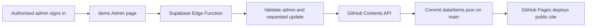

# Build Handover: Private Items Admin Hub

This document is the build brief for an AI or developer creating the first private content-management page for the SCAVLAND fan database.

The goal is a small, safe first release: the site owner signs in, finds an item, edits its shared information and image, then publishes the change to GitHub. A later phase can add specialist editors for armour, weapons, crafting and vendors.

## Repository and boundaries

- **Repository:** `scavlandfanbase/scavlandfanbase.github.io`
- **Branch:** `main`
- **Public site:** GitHub Pages
- **Existing private login/review page:** `admin.html`
- **Existing item catalogue:** `items.html`
- **Central item data:** `data/items.json`
- **Existing login/backend:** Supabase project `demtoqsafufzmnhvaykj`

Do not replace the public site, convert it to a framework, or reorganise the existing JSON files. Extend the existing static HTML/CSS/JavaScript style.

Do not change a canonical game value merely because an item is edited. The existing evidence rule remains in force: only direct in-game evidence may set `source.status` to `screenshot-verified`.

## First-version scope

Build one new private page, preferably `items-admin.html`, with these features:

1. Sign in using the same Supabase Auth approach as `admin.html`.
2. Confirm the signed-in user is an authorised SCAVLAND admin before showing any editor.
3. Load and search every record in `data/items.json`.
4. Select a record and edit only its shared item fields:
   - `name`
   - `classification`
   - `image`
   - `notes`
   - existing shared fields when present: `estimatedPrice`, `rank`, `maxStack`, `description`, `stackable`
   - `source.file`, `source.status`, `source.note`, and `source.lastVerified` where relevant
5. Preview the chosen item image before publishing.
6. Validate every image/evidence path before saving.
7. Show a clear summary of the pending change before publish.
8. Publish the updated `data/items.json` to GitHub with a useful commit message.
9. Show success only after GitHub confirms the commit. Include a link to the commit or file when practical.

Do **not** build editors for resistance stats, weapon stats, recipes or vendor inventory in this first version. Those remain in their specialist files:

- Armour: `data/armour.json`
- Weapons: `data/weapons.json`
- Recipes: `data/crafting.json`
- Vendor inventory: `data/vendors.json`

The central item record already controls item identity, categories and the image used by the Items page. Specialist pages may use their own image field until a later consolidation phase.

## Existing item record shape

`data/items.json` contains an object with a `data` array. An item normally looks like this:

```json
{
  "id": "example-item",
  "name": "Example Item",
  "classification": ["crafted-item", "vendor-item"],
  "image": "evidence-inbox/items/example-item__tooltip__2026-09-21.png",
  "notes": null,
  "estimatedPrice": 1000,
  "rank": 1,
  "maxStack": 5,
  "source": {
    "file": "evidence-inbox/items/example-item__tooltip__2026-09-21.png",
    "status": "screenshot-verified",
    "note": "Direct in-game tooltip."
  }
}
```

Rules for the editor:

- Never change `id` in the first version. Other files use it as a stable reference.
- Keep `classification` to the existing supported values: `weapon`, `armour`, `ammunition`, `crafted-item`, `crafting-resource`, `vendor-item`.
- `image` is the preferred card-picture field. It must be a repository-relative path beginning with `images/` or `evidence-inbox/` and ending in `.png`, `.jpg`, `.jpeg` or `.webp`.
- `source.file` identifies evidence. It must be a direct repository-relative path, such as `evidence-inbox/items/file.png`. Never append a new path to an old one.
- If `source.status` is `screenshot-verified`, ensure the evidence file is genuine direct evidence. Otherwise keep the existing appropriate status or use an explicitly unverified status.
- Blank optional values should become `null`, not the text `"null"`.

## Image workflow

For the first version, support selecting an existing image path from the repository and entering a path manually with validation. This avoids building a complicated image-to-GitHub upload workflow at the same time as the editor.

Validation must reject:

- Absolute paths such as `C:\\...`
- URLs such as `https://...`
- `..` path traversal
- A path that does not start with `images/` or `evidence-inbox/`
- A missing file
- An unsupported image extension

Show the image preview only after the path validates. A missing image must not leave a broken image box on the page.

Adding new image uploads can be a second milestone. If implemented later, upload the screenshot into the repository under a descriptive category path and then set both `image` and `source.file` to that same exact path when appropriate.

## Secure publishing design

GitHub Pages is static. Browser JavaScript must **never** contain a GitHub personal token, GitHub App private key, service-role Supabase key, or any other write credential.

Use this flow:



The frontend sends the signed-in user’s Supabase access token to the Edge Function. The Edge Function must verify the token and verify the user is on the existing SCAVLAND admin allowlist before it calls GitHub.

Store the GitHub write credential only as an Edge Function secret. Use the narrowest practical credential: a GitHub App installation token is preferred; a fine-grained token restricted to this one repository and repository contents write access is acceptable for the first release. Never return the credential to the browser or write it to the repository.

The publishing function should:

1. Verify the Supabase user and admin authorisation.
2. Accept one item ID and a strictly allowed set of changed fields.
3. Fetch the current `data/items.json` from GitHub.
4. Re-run all server-side validation; never trust browser validation alone.
5. Find exactly one matching item ID.
6. Replace only that record and preserve every other item.
7. Commit with a message such as `Update item: Advanced Gun Repair Kit`.
8. Return the GitHub commit URL/SHA to the admin page.

Do not let the browser send arbitrary GitHub file paths, arbitrary commit targets, or free-form repository requests to the function.

## Supabase requirements

Reuse the current Supabase Auth and the existing `is_scavland_admin` authorisation pattern used by `admin.html` and `evidence-import.html`.

Before making any Supabase change:

- Inspect the current auth/RLS setup and preserve the working evidence review flow.
- Keep all privileged secrets server-side.
- Apply least privilege: only authorised authenticated admins may invoke publishing.
- Verify the function rejects anonymous users, signed-in non-admins, invalid item IDs, invalid image paths and attempts to edit fields outside the allowed list.

Do not loosen the public evidence submission policies to make the admin hub work.

## User experience

Follow the current SCAVLAND visual style from `site-theme.css` and `admin.html`:

- Dark panels and gold headings.
- Clear labels and simple plain-English help.
- A search field with an item list on the left and an editor panel on the right on desktop.
- A single-column layout on mobile.
- Save/Publish disabled until validation passes.
- A visible warning before publishing: `This will update the public website after GitHub Pages deploys.`
- A small before/after summary for edited fields.
- Clear error messages that say what to fix.

Avoid a large dashboard. The first page should make one item edit easy and safe.

## Required validation and testing

Before handover, complete and report these checks:

## Items Admin deployment

The static page is `items-admin.html`. Deploy the publish function from the repository root with the Supabase CLI after linking project `demtoqsafufzmnhvaykj`:

```text
supabase login
supabase link --project-ref demtoqsafufzmnhvaykj
supabase secrets set GITHUB_TOKEN=<fine-grained-token>
supabase functions deploy publish-item --no-verify-jwt
```

Use a fine-grained GitHub token restricted to this repository with Contents: Read and write only. `SUPABASE_URL` and `SUPABASE_ANON_KEY` are provided by the Supabase function environment; do not add them or `GITHUB_TOKEN` to the repository. The function itself verifies the bearer token and calls `is_scavland_admin`, so `--no-verify-jwt` is used only because the function performs the authorization check and returns the appropriate CORS response. Review the function URL and browser origin before publishing the page.

## Completed 21 September 2026

- Added `items-admin.html` with Supabase sign-in, `is_scavland_admin` authorization, item search, shared-field editing, image preview, path validation, before/after summary, and publish confirmation.
- Added `supabase/functions/publish-item/index.ts`. It accepts only one item ID and the allowed shared fields, revalidates the request server-side, fetches the current GitHub file, updates exactly one record, and returns the commit URL/SHA after GitHub confirms the commit.
- Notes remain admin-only. They can be stored in `data/items.json`, but the public `items.html` renderer does not display them.
- Linked the local repository to Supabase project `demtoqsafufzmnhvaykj`, configured the GitHub write secret, and deployed the `publish-item` Edge Function successfully.
- Published commits to `main`: `c9a1132` (`Add private items admin hub`) and `9fe24b7` (`Ignore Supabase local metadata`). Supabase CLI-generated `.temp` files were removed from the repository and added to `.gitignore`.
- Confirmed an authorized admin can edit a test item and see the change committed in `data/items.json`.
- Passed `node scripts/validate-evidence.cjs`, JSON parsing, page JavaScript syntax checks, invalid image-path checks, and public Items-page/image smoke checks.
- Tested the admin page locally at desktop (1440px) and mobile (390px) widths. The login gate showed correctly and the editor stayed hidden before authorization.
- No GitHub token, private key, password, or service-role credential was committed to the repository.

Still recommended before treating this as fully verified: test a signed-in non-admin account, test one approved production edit through the live Pages URL, confirm the resulting public deployment, and record the final commit link. Do not leave temporary test data in the public database.

1. Run the repository's `validate-evidence.cjs` validation if applicable and ensure JSON remains valid.
2. Confirm the public Items page still loads and searches correctly.
3. Confirm an existing item image still previews correctly.
4. Confirm an image with an invalid path is rejected before publish.
5. Confirm a non-admin cannot open the editor or publish.
6. Confirm an admin can edit a safe test record and the GitHub commit changes only the intended item.
7. Confirm the changed name/image appears on the live public Items page after deployment.
8. Test the admin editor at desktop and mobile widths.
9. Check that no token, private key, password or service-role credential is committed or exposed in page source.

If a live test needs a temporary value, restore the real value immediately afterwards or use a clearly disposable test record agreed with the owner.

## Handover back for review

When the build is complete, provide:

- The branch or pull-request URL.
- A short summary of files added and changed.
- The exact steps the owner must take to set secrets or deploy the Edge Function, if any.
- The test results above.
- Any limitation deliberately left for the next phase.

Do not merge or publish final changes until the owner has reviewed the result, unless they explicitly ask for publication.

## Phase two, after this works

Only after the Items Admin Hub is reliable, add separate specialist editors:

1. Armour editor for resistance, repair class and durability evidence.
2. Weapon editor for weapon stats and ammunition.
3. Crafting editor for recipes and ingredients.
4. Vendor editor for inventories, ranks, prices, portraits and shop galleries.

Each specialist editor must update its dedicated JSON file, preserve evidence status rules and avoid overwriting unrelated data.

